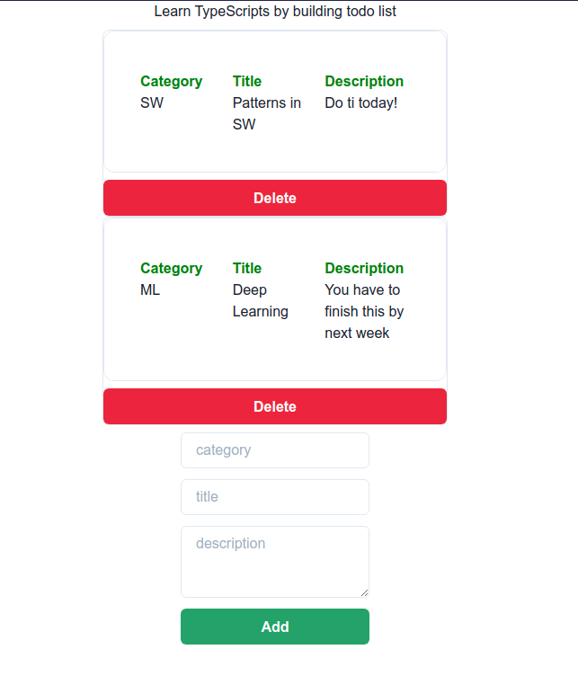

# ToDo-List App

Below you can see the simple todo list application build with typescript and chakra ui!

## What I Learned
1.What is TypeScript

2.Create a TypeScript React App

3.Handling State

4.Handling Props

5.Handling Functions

6.Handling Events

